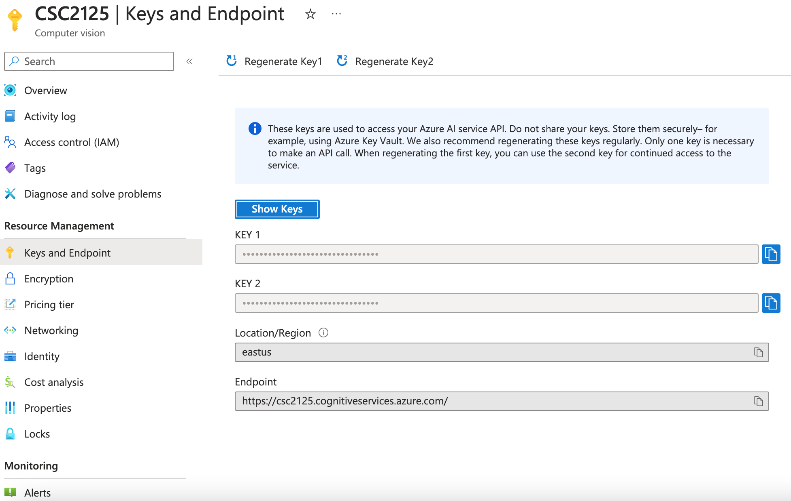

# Albumy

*Capture and share every wonderful moment.*

> Example application for *[Python Web Development with Flask](https://helloflask.com/en/book/1)* (《[Flask Web 开发实战](https://helloflask.com/book/1)》).

Demo: http://albumy.helloflask.com


## Installation

clone:
```
$ git clone https://github.com/greyli/albumy.git
$ cd albumy
```
create & activate virtual env then install dependency:

with venv/virtualenv + pip:
```
$ python -m venv env  # use `virtualenv env` for Python2, use `python3 ...` for Python3 on Linux & macOS
$ source env/bin/activate  # use `env\Scripts\activate` on Windows
$ pip install -r requirements.txt
```
or with Pipenv:
```
$ pipenv install --dev
$ pipenv shell
```

## Set up Azure account

1. Create a Computer Vision resource in Azure portal following [this guide](https://learn.microsoft.com/en-us/azure/ai-services/computer-vision/quickstarts-sdk/image-analysis-client-library?pivots=programming-language-python&tabs=linux%2Cvisual-studio)

2. Find out your keys Go by going to the Azure portal. If the resource you created in the Prerequisites section deployed successfully, select Go to resource under Next Steps. You can find your key and endpoint under Resource Management in the Keys and Endpoint page. Example for a screenshot of the Keys and Endpoint page:



3. Set the `VISION_KEY` and `VISION_ENDPOINT` variables in [`.env`](.env) file to the values from your Azure account

generate fake data then run:
```
$ flask forge
$ flask run
* Running on http://127.0.0.1:5000/
```
Test account:
* email: `admin@helloflask.com`
* password: `helloflask`

## Testing

To run the tests please use:
```bash
python -m unittest tests.<test_file_name>
```

For example to run the ml tests:
```bash
python -m unittest tests.test_ml
```

## License

This project is licensed under the MIT License (see the
[LICENSE](LICENSE) file for details).
